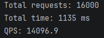

# 🚀 PhotonRPC (v1.0)


> [📙 中文](README_CN.md) | [📘 English](README.md)
 

## 📌项目概述

**PhotonRPC** 是一个基于 **C++20** 实现的高性能 RPC 运行时，
定位为 **分布式控制平面的通信基座（Control Plane Substrate）**。

与通用 RPC 框架不同，PhotonRPC 的设计目标并非“业务 RPC”，
而是服务于 **控制路径（control path）**，例如：

- 元数据服务
- 调度器 / 协调器
- 分布式系统中的状态管理与通知机制

**v1.0** 版本聚焦于构建一个
**简洁、可解释、可演进的 RPC 数据平面**，
为后续控制平面能力的引入打下坚实基础。


## 🔥设计目标

PhotonRPC 的长期设计目标包括：

- **面向控制平面**：针对低负载、低延迟、高一致性需求优化
- **低延迟与可预测性**：明确的事件循环与关键路径
- **强调可解释性**：避免黑盒封装，便于学习与调试
- **自然演进**：从同步 RPC 演进至协程、共识与状态复制

---

## ✨ 核心特性 (Features)

*   **高性能网络库**：基于 `Epoll` + `Reactor` 模式实现的非阻塞网络 IO，支持高并发连接。
*   **协议支持**：自定义应用层协议（Magic+MsgID+Data），有效解决 TCP 粘包/半包问题。
*   **序列化**：深度集成 **Google Protobuf**，支持高效的二进制序列化与反序列化。
*   **服务治理**：
    *   支持基于 XML 的配置文件加载。
    *   实现了应用层 **Buffer**，支持动态扩容，未来会支持零拷贝。
    *   支持服务的自动注册与反射调用。
*   **基础设施**：
    *   引入了高性能**异步日志库**（spdlog项目），支持日志分级。
    *   引入 **Google Test** 单元测试框架，关键代码部分实现90%+的测试覆盖率。

## 🏗️ 架构设计 (Architecture)

*(待补充)*


## 🛠️ 安装与编译 (Installation)

### 依赖环境
*   OS: Linux (Ubuntu 20.04+ 推荐)
*   Compiler: g++ >= 10.0 (支持 C++20)
*   CMake >= 3.10
*   Protobuf (需安装 `protobuf-compiler` 和 `libprotobuf-dev`) 

### 构建步骤
```bash
# 1. 下载源码
git clone https://github.com/Raltour/PhotonRPC
cd PhotonRPC

# 2. 执行一键编译脚本
chmod +x autobuild.sh
./autobuild.sh

# 编译完成后:
# 静态库位于: lib/libphotonrpc.a
# 示例程序位于: bin/
```


## 💻 使用示例 (Example)

### 1. 定义接口 (Protobuf)
编写 `echo_service.proto`:
```protobuf
syntax = "proto3";
package photonrpc;
option cc_generic_services = true; // 开启 RPC 服务生成

message EchoRequest { string msg = 1; }
message EchoResponse { string msg = 1; }

service EchoService {
  rpc Echo(EchoRequest) returns (EchoResponse);
}
```

### 2. 服务端开发 (Provider)
```cpp
#include <photonrpc/rpc/rpc_server.h>
#include "echo_service.pb.h"

// 继承 Protobuf 生成的 Service 类
class EchoServiceImpl : public photonrpc::EchoService {
public:
    void Echo(google::protobuf::RpcController* controller,
              const photonrpc::EchoRequest* req,
              photonrpc::EchoResponse* res,
              google::protobuf::Closure* done) override {
        // 业务逻辑：回显消息
        res->set_msg("Server Echo: " + req->msg());
        if (done) done->Run();
    }
};

int main() {
    photonrpc::RpcServer server;
    server.RegisterService(new EchoServiceImpl()); // 注册服务
    server.Start(); // 启动 Reactor 循环
    return 0;
}
```

### 3. 客户端开发 (Consumer)
```cpp
#include <photonrpc/rpc/rpc_channel.h>
#include "echo_service.pb.h"

int main() {
    // 建立连接
    photonrpc::RpcChannel channel("127.0.0.1", 12345);
    photonrpc::EchoService_Stub stub(&channel);
    
    // 准备请求
    photonrpc::EchoRequest req;
    req.set_msg("Hello PhotonRPC!");
    photonrpc::EchoResponse res;
    photonrpc::RpcController controller;
    
    // 发起 RPC 调用
    stub.Echo(&controller, &req, &res, nullptr);
    
    if (!controller.Failed()) {
        std::cout << "Success: " << res.msg() << std::endl;
    }
    return 0;
}
```

## 📊 性能测试 (Benchmark)

在单线程 Reactor 模式下，针对 Echo 请求（包体大小 100 Byte），QPS 表现如下：

*   **测试环境**: Ubuntu 24.04 (WSL2), AMD Ryzen 7 8845H, 32GB RAM
*   **连接数**: 100 并发连接
*   **QPS**: **~14,000**




## 目录结构 (Directory)

<details>
<summary>点击展开查看完整目录树</summary>

```text
├── CMakeLists.txt
├── README.md
├── auto_build.bash
├── conf
│         └── photonrpc.xml
├── include
│         └── photonrpc
│             ├── common
│             │         ├── config.h
│             │         └── logger.h
│             ├── net
│             │         ├── acceptor.h
│             │         ├── buffer.h
│             │         ├── channel.h
│             │         ├── codec.h
│             │         ├── event_loop.h
│             │         ├── poller.h
│             │         ├── tcp_connection.h
│             │         └── tcp_server.h
│             ├── protocol
│             │         └── rpc_message.pb.h
│             └── rpc
│                 ├── rpc_channel.h
│                 └── rpc_server.h
├── src
│         ├── CMakeLists.txt
│         ├── common
│         │         ├── config.cc
│         │         └── logger.cc
│         ├── net
│         │         ├── acceptor.cc
│         │         ├── buffer.cc
│         │         ├── channel.cc
│         │         ├── event_loop.cc
│         │         ├── poller.cc
│         │         ├── tcp_connection.cc
│         │         └── tcp_server.cc
│         ├── protocol
│         │         ├── rpc_message.pb.cc
│         │         ├── rpc_message.pb.h
│         │         └── rpc_message.proto
│         └── rpc
│             ├── rpc_channel.cc
│             └── rpc_server.cc
├── test
│         ├── CMakeLists.txt
│         ├── benchmark.cc
│         ├── consumer.cc
│         ├── integration_test
│         │         ├── calculate_service_pb2.py
│         │         ├── echo_service_pb2.py
│         │         ├── integration_test.py
│         │         └── rpc_message_pb2.py
│         ├── protocol
│         │         ├── calculate_service.pb.cc
│         │         ├── calculate_service.pb.h
│         │         ├── calculate_service.proto
│         │         ├── echo_service.pb.cc
│         │         ├── echo_service.pb.h
│         │         └── echo_service.proto
│         ├── provider.cc
│         ├── test_buffer.cc
│         └── test_codec.cc
└── third_party
    ├── googletest
    ├── spdlog
    └── tinyxml2
        ├── tinyxml2.cpp
        └── tinyxml2.h
```
</details>


## 🗺️ 开发计划 (Roadmap)

本项目遵循迭代开发的原则，致力于打造一个高性能、现代化的分布式通信基座。


- [x] **v1.0 (Current)**: **MVP 发布**。实现RPC框架的基础功能与调用流程。
    - 实现基础 Reactor 网络库，封装Epoll进行多路复用。
    - 对Protobuf 协议进行封装，支持自定义服务内容。
    - 实现服务端反射调用机制。
- [ ] **v1.1**: **性能调优与鲁棒性**。
    - 深度 Profiling（使用 perf/gprof），针对 P99 延迟进行测量与优化。
    - 引入 ASan/Valgrind 进行全链路内存检测，确保零内存泄漏。
    - 优化 Critical Path 代码，提升单线程极限 QPS。
- [ ] **v1.2**: **高并发架构升级**。
    - 引入 **IO 线程池 (Multi-Reactor)**，实现 "One Loop Per Thread" 模型。
    - 利用 `eventfd` 实现高效的线程唤醒与任务分发，充分压榨多核 CPU 性能。
- [ ] **v2.0**: **异步编程革命**。
    - 引入 **C++20 Coroutine (协程)**，封装 `Co_Await` 接口。
    - 彻底消除传统异步编程的“回调地狱”，实现同步语义写出异步代码。
- [ ] **v3.0**: **控制平面演进 (Control Plane)**。
    - 实现简化版 **Raft 共识算法** (Leader Election, Log Replication)。
    - 从单纯的 RPC 数据平面框架，升级为具备状态机复制能力的分布式控制平面，支持构建高可用的分布式 KV 存储。
- [ ] **v4.0**: **异构网络传输 (RDMA)**。
    - 抽象 Transport 层，支持 **RDMA (RoCE v2)** 协议。
    - 实现 Kernel Bypass 与 Zero-Copy，在高性能计算中心网络环境下实现微秒级延迟。


## 📚 第三方库依赖 (Third-party Libraries)

本项目站在巨人的肩膀上，感谢以下开源项目：

| **库名称**     | **用途**                                    | **许可证**   |
| -------------- | ------------------------------------------- | ------------ |
| **spdlog**     | 高性能异步日志记录，支持控制台及文件输出    | MIT          |
| **tinyxml2**   | 轻量级 XML 解析器，用于加载服务器配置文件   | zlib         |
| **GoogleTest** | 工业级 C++ 测试框架，用于单元测试与集成测试 | BSD-3-Clause |


